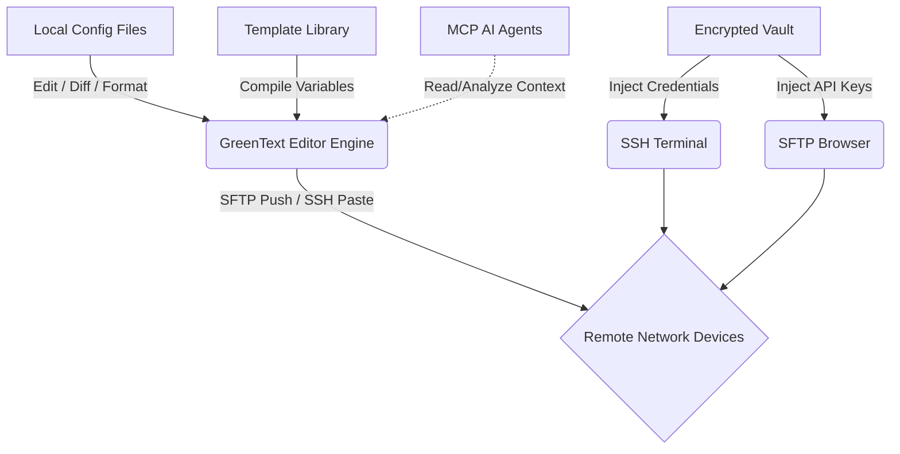

# GreenText

GreenText is a modern, cross-platform standalone network configuration editor built to be a massive upgrade over generic text editors. Think of it as a lightning-fast combination of BBEdit and Termius, built specifically for network engineers working with **Aruba**, **Juniper**, and **Mist**.

## Why GreenText?

Standard text editors break when you paste massive firewall policies or dump thousands of lines of log files containing non-ASCII control characters. Generic IDEs like VS Code are bloated with web-development plugins that do not understand network syntaxes. 

GreenText is purpose-built to handle massive networking files safely, format code correctly, and integrate directly with your remote network infrastructure.

---

## Architecture & Workflow

GreenText operates as the unified offline and online cockpit for network configuration.



### Component Breakdown
1. **Tauri + React + TypeScript + Tailwind CSS**: A lightweight, secure desktop shell that communicates natively with the OS.
2. **Monaco Editor Engine**: The same robust editing core as VS Code, but aggressively tuned to skip heavy language-server protocols in favor of raw text parsing and massive file handling.
3. **Local Store (Zustand)**: Zero telemetry, zero cloud tracking. Your open buffers, configurations, and vault entries never leave your machine.

---

## Core Features

### Powerful Text Processing
The **Inspector Panel** contains an armory of tools that instantly clean up bad configs:
- **Pretty Indent**: Auto-format entire Aruba CX, AOS-S, or Juniper Junos configurations in one click based on curly-brace depth or block hierarchy.
- **Process Duplicate Lines**: Deduplicate massive prefix/access lists without sorting them.
- **Zap Gremlins**: Instantly wipe non-ASCII control characters that cause terminal crashes when copy-pasting from PDFs or web forums.
- **Sort / Reverse Lines**: Organize long blocks of interfaces alphabetically.
- **Change Case**: Rapidly normalize standard uppercase `DESCRIPTION` fields.

### Connected Workflows
- **SSH / Telnet Terminal**: `xterm.js` embedded directly in your editor tabs to hit remote boxes natively.
- **SFTP Browser**: Graphically browse remote file systems over SSH, parse log directories (`/var/log/messages`), and pull files right into GreenText.
- **Encrypted Credential Vault**: Store device passwords and API keys locally via AES-256-GCM.
- **MCP Servers Panel**: Spin up and manage Model Context Protocol AI integrations right from the UI to let external agents parse your configurations.
- **Regex Pattern Playground**: Extract the current file and live-test complex regex patterns with immediate visual feedback on capture groups and replacements.

### Multi-File Workspace
- **Project Explorer**: Open entire folders. Files are automatically grouped by directory and sortable by Name, Extension, Size, or Path.
- **Instant Search**: Rust-powered backend regex search queries across thousands of files instantly, with clickable matches routing directly to the line number.
- **Interactive Diff Engine**: Enter "Diff Mode" to compare your current, dirty config against the version saved on disk, allowing you to selectively revert blocks of text before pushing to a switch.

---

## Keyboard Shortcuts

| Shortcut | Action |
| --- | --- |
| `Cmd/Ctrl+P` | Command palette |
| `Cmd/Ctrl+B` | Toggle left sidebar (Project files) |
| `Cmd/Ctrl+T` | Open SSH Terminal tab |
| `Cmd/Ctrl+\` | Toggle split view |
| `Cmd/Ctrl+Shift+G` | Toggle diff view |
| `Cmd/Ctrl+Shift+F` | Find in project |
| `Cmd/Ctrl+Alt+Shift+F` | Pretty Indent current config |

---

## Development & Setup

Prerequisites:
- Node.js (v18+)
- Rust & Cargo (for Tauri backend)

### Initial Setup
```bash
npm install
```

### Local Development
To run the app locally with hot-module reloading:
```bash
npm run tauri:dev
```

### Build & Package
To compile a native binary (`.dmg`, `.app`, or `.exe` depending on your OS):
```bash
npm run lint
npm run build
npm run tauri -- build --no-bundle
```

---

*GreenText is built and maintained by Choate Labs.*
